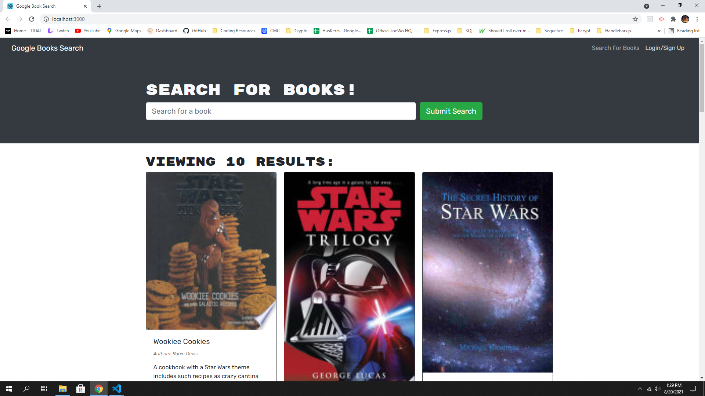

  <h1 align="center">C-Dubs Book Search</h1>
  
 
## Description
Search books on Google and save them to your account to reference later!
[Website-Link](https://cdubs-book-search.herokuapp.com/)
## Table of Contents
- [Description](#description)
- [Installation](#installation)
- [Usage](#usage)
- [License](#license)
- [Contributing](#contributing)
- [Demo](#demo)
- [Questions](#questions)
## Installation
💾 Once downloaded, from the root directory, npm i to install all packages and then npm run develop to launch app.
## Usage
💻 To quickly search for any book online.
## License
   This application is covered by the MIT license.
## Contributing
👪 Chris Winters
## Demo
✏️ Link to deployed site: [Book-Search](https://cdubs-book-search.herokuapp.com/)
The website looks this:

## Questions
🙋‍♂️ Email or reach me on my GitHub  
 
:octocat: Find me on GitHub: [cwinters87](https://github.com/cwinters87) 
 
✉️ Email me with any questions: taylor314@gmail.com  
🌟This README was generated by Chris Winters using the [readme-generator](https://github.com/cwinters87/readme-generator)
